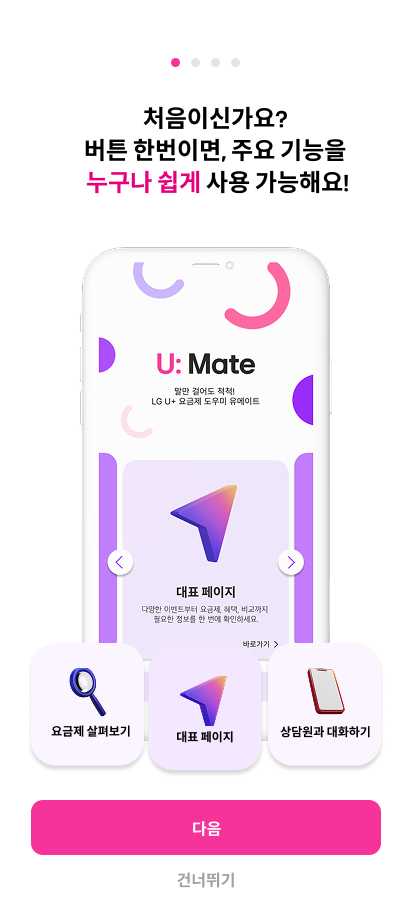
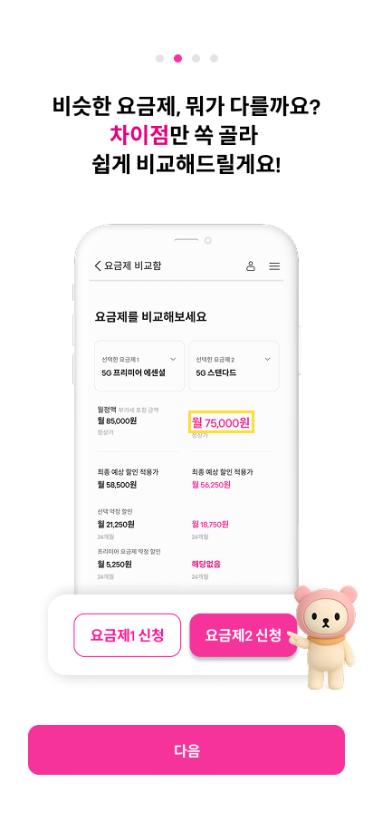
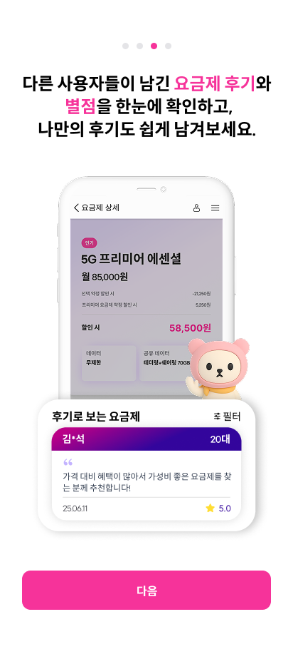
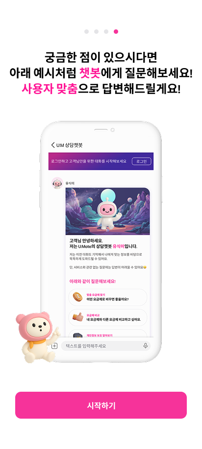

# U\:Mate (유메이트)

> 💡 **AI 챗봇 기반 통신사 요금제 추천 및 관리 서비스**
> "U+의 모든 세대의 메이트가 되겠습니다."

---

## 📌 서비스 개요

U\:Mate (유메이트)는 통신사 요금제를 쉽고 빠르게 탐색하고, AI 챗봇과의 대화를 통해 사용자에게 맞춤형 요금제를 추천하는 서비스입니다.

특히 디지털 취약 계층(시니어)도 쉽게 접근할 수 있도록 **접근성과 편의성**을 강화하여 설계되었습니다.

---

## 👭 서비스명과 의미

* **U\:Mate**

  * **뜻**: LG **U+** + **Mate (친구, 도우미)**
  * **의미**: 모든 세대의 디지털 친구, 사용자 맞춤 요금제 도우미

---

## 🎯 목적 및 기획 의도

* AI 챗봇과 요금제 조회·비교·리뷰 기능을 통해 **합리적인 선택**을 돕는다.
* **시니어 사용자**도 쉽게 이용할 수 있도록 **핵심 기능을 단순화**하여 제공한다.

---

## ✨ 주요 구현 기능

| 기능                       | 상세 설명                                                                                      |
| ------------------------ | ------------------------------------------------------------------------------------------ |
| **1. 챗봇 대화를 통한 요금제 추천**  | 사용자의 데이터 사용량, 통화 습관, 예산 등을 자연어로 입력받아 AI가 최적 요금제를 추천 · 대화 기억 · 음성/텍스트 지원 |
| **2. 시니어 전용 페이지 (바로가기)** | 진입 시 별도의 안내 페이지 제공 → **핵심 기능만 큼직한 버튼**으로 구성하여 직관적 사용성 강화                                   |
| **3. 요금제 리뷰**            | 리뷰/별점 작성, 수정, 삭제, 조회 기능 제공                                                                 |
| **4. 요금제 목록**            | 50여 개의 다양한 요금제 제공, 다중 필터링으로 탐색 가능                                                          |
| **5. 요금제 비교 분석**         | 데이터, 통화, 가격 등 **항목별 비교 기능**                                                                |
| **6. 회원가입/로그인**          | 개인화 서비스 제공 · 챗봇 대화 내역 저장 · 멤버십 등급 기반 혜택 노출 · 연령대 기반 맞춤 추천                         |

---

## 🧭 예상 유저 플로우

1. **서비스 진입**

   * 시니어 친화적 바로 가기 페이지 → 핵심 기능만 노출
2. **챗봇 대화 시작**

   * 사용자가 자연어 입력 → OpenAI API 기반 챗봇이 요금제 추천
   * 비로그인 사용자는 로그인 유도
3. **회원가입 / 로그인**

   * 개인화 기능 활성화 (이전 대화 불러오기, 멤버십 혜택 반영, 추천 결과 저장)
4. **요금제 탐색 및 비교**

   * 추천 요금제 확인 / 목록에서 조건별 탐색 → 비교 탭에서 상세 비교
5. **요금제 상세 & 리뷰**

   * 사용자 리뷰 열람 및 작성 → 정보 공유 & 신뢰 형성

---

## 🖼️ 기능 화면 예시

| 온보딩 1                              | 온보딩 2                              |
| ---------------------------------- | ---------------------------------- |
|  |  |

| 온보딩 3                              | 온보딩 4                              |
| ---------------------------------- | ---------------------------------- |
|  |  |

---

## 🔗 프로젝트 링크

* 🌐 [배포 사이트 (Vercel)](https://umate.vercel.app)
* 🎨 [Figma 디자인 시안](https://www.figma.com/design/yFIc8bQiI2uzH0o7XGkvqZ/-%EC%9C%A0%EB%A0%88%EC%B9%B4-%EC%A2%85%ED%95%A9%ED%94%84%EB%A1%9C%EC%A0%9D%ED%8A%B8--5%ED%8C%80--%EC%9C%A0%EB%A9%94%EC%9D%B4%ED%8A%B8?node-id=0-1&t=4V0zRBZu9pckzTbD-1)
* 📊 [발표 자료 (Canva)](https://www.canva.com/design/DAGrahLxUcQ/Eyw86zhcfPz9vi9mTbTmLA/edit)
